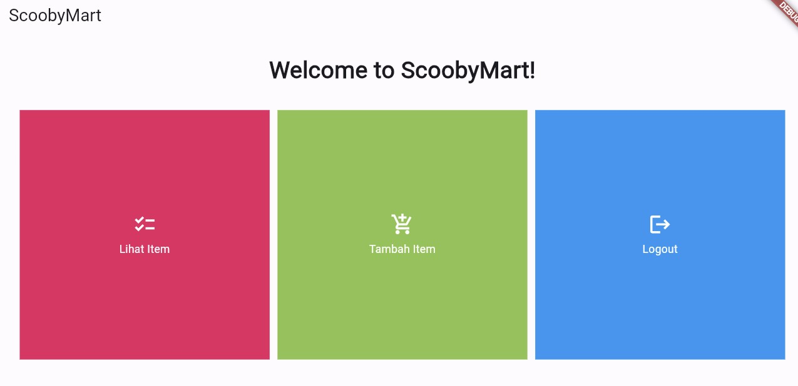

## 📖**ASSIGNMENTS PBP**📖
<details>
<summary>📋Assignment 7</summary>

## **DAFTAR ISI**
* [Perbedaan *stateless* dan *stateful widget* dalam Flutter](#a-perbedaan-utama-stateless-dan-stateful-widget-dalam-konteks-pengembangan-aplikasi-flutter)
* [Penjelasan *Widget* dan Fungsinya](#b-penjelasan-widget-dan-fungsinya)
* [Implementasi *Checklist*](#c-implementasi-checklist-part-1)
* [BONUS](#d-bonus-part-1)
<hr>


## **A. Perbedaan Utama *stateless* dan *stateful Widget* dalam Konteks Pengembangan Aplikasi Flutter**
| *Stateless Widget* | *Stateful Widget* |
| --- | --- |
| *Widget* statis | *Widget* dinamis |
| Hanya diperbaharui saat diinisialisasi | Berubah secara dinamis|
| Tidak memiliki `setState()`. Hanya akan dirender sekali dan tidak dapat diperbaharui sendiri | Memiliki internal `setState()` dan dapat dirender ulang jika data masukkan berubah |
| Tidak dapat diperbaharui selama *runtime*, kecuali terjadi peristiwa eksternal | Dapat diperbaharui selama *runtime* berdasarkan tindakan pengguna atau perubahan data |
| Contoh: Text, Icon, dan RaisedButton | Contoh: Checkbox, Tombol Radio, dan Slider |

<br>

*Source:*
* https://www.geeksforgeeks.org/difference-between-stateless-and-stateful-widget-in-flutter/
* https://blog.logrocket.com/difference-between-stateless-stateful-widgets-flutter/
<br>

## **B. Penjelasan *Widget* dan Fungsinya**
| Nama *Widget* | Fungsi |
| --- | --- |
| `MyHomePage` | *Stateless widget* untuk mengatur tampilan utama aplikasi |
| `Scaffold` | Untuk kerangka utama dari halaman, yang mencakup `AppBar` dan `Body` |
| `AppBar` | Untuk menampilkan bilah atas pada halaman, yaitu `ScoobyMart` |
| `SingleChildScrollView` | Untuk membuat area konten yang dapat digulir jika konten melebihi ukuran layar |
| `Padding` | Untuk menambahkan jarak di sekitar *widget-child* |
| `Column` | Untuk mengatur *widget-children* secara vertikal |
| `Text` | Untuk menampilkan teks `Welcome to ScoobyMart!` pada tengah halaman |
| `GridView.count` | Untuk membuat tata letak grid dengan jumlah kolom yang tetap |
| `ShopItem` | Kelas yang mendefinisikan item toko yang memiliki nama, ikon, dan warna |
| `ShopCard` | Untuk mewakili *card* yang menampilkan item toko |
| `Material` | Untuk mengatur bahan dasar *card* dengan warna latar belakang yang sesuai |
| `InkWell` | Untuk membuat area responsif terhadap sentuhan (*tap*) |
| `Container` | Untuk mengelola tata letak dan konten dalam *card* |
| `Icon` | Untuk menampilkan ikon dalam kartu |
| `SnackBar` | Untuk menampilkan pesan singkat yang muncul di bawah layar saat item toko diklik |
| `MyApp` | Untuk menginisialisasi dan mengkonfigurasi aplikasi |
| `MaterialApp` | Untuk mengkonfigurasi dan mengatur tema aplikasi, termasuk `title`, `theme`, dan `home` |
| `ColorScheme` | Untuk mengatur palet warna dalam aplikasi |
| `useMaterial3` | Untuk mengaktifkan penggunaan `Material You` |

<br>

*Source:*
* https://www.geeksforgeeks.org/what-is-widgets-in-flutter/
<br>

## **C. Implementasi *Checklist* Part 1**
#### Membuat Proyek Flutter Baru
1. Pertama kali, saya membuat folder dengan nama `scoobymart`. 
<br>

2. Kedua, saya *generate* proyek Flutter baru dengan nama `scoobymart`. Lalu, masuk ke dalam direktori proyek seperti berikut.
```bash
flutter create scoobymart
cd scoobymart
```
<br>

3. Ketiga, saya menjalanlan proyek melalui Command Prompt seperti berikut.
```bash
flutter run
```
<br>

4. Selanjutnya, saya juga menjalankan perintah untuk *enable web support* dan menjalankan proyek di aplikasi Google Chrome seperti berikut.
```bash
flutter config --enable-web
flutter run -d chrome
```
<br>

5. Lalu, saya melakukan `git init` pada *root folder* dan `add`, `commit`, `push` proyek ke repositori baru di GitHub dengan nama `scoobymart`.
<br>

#### Merapikan Struktur Proyek
1. Pertama, saya membuat file baru bernama `menu.dart` pada direktori `scoobymart/lib` dan mengimpor kode seperti berikut.
```dart
import 'package:flutter/material.dart';
```
<br>

2. Pada `main.dart`, saya memotong kode baris ke-39 sampai akhir yang berisi *class* seperti berikut. Lalu, saya pindahkan ke `menu.dart`.
```dart
class MyHomePage ... {
    ...
}

class _MyHomePageState ... {
    ...
}
```
<br>

3. Selanjutnya, saya mengimpor suatu kode untuk menghilangkan *error* pada `main.dart` seperti berikut.
```bash
import 'package:scoobymart/menu.dart';
```
<br>

#### Membuat Widget Sederhana pada Flutter
1. Awalnya, saya membuka file `main.dart`. Lalu, mengubah kodenya pada bagian tema aplikasi yang mempunyai tipe `Material Color` seperti berikut.
```dart
colorScheme: ColorScheme.fromSeed(seedColor: Colors.indigo),
```
<br>

2. Kedua, saya menghapus `MyHomePage(title: 'Flutter Demo Home Page')` pada file `main.dart` menjadi seperti berikut.
```dart
MyHomePage()
```
<br>

3. Pada file `menu.dart`, saya mengubah sifat *widget* menjadi *stateless* dengan melakukan perubahan pada `({super.key, required this.title})` menjadi `({Key? key}) : super(key: key);` dan menghapus `final String title;` sampai bawah serta menambahkan *Widget Build* sehingga terlihat seperti berikut.
```dart
class MyHomePage extends StatelessWidget {
    MyHomePage({Key? key}) : super(key: key);

    @override
    Widget build(BuildContext context) {
        return Scaffold(
            ...
        );
    }
}
```
<br>

4. Kemudian, saya menambahkan teks dan *card* serta memulai *define* tipe pada list yang saya punya seperti berikut.
```dart
class ShopItem {
  final String name;
  final IconData icon;
  final Color color;

  ShopItem(this.name, this.icon, this.color);
}
```
<br>

5. Lalu, pada bagian bawah kode `MyHomePage({Key? key}) : super(key: key);`, saya menambahkan nama, harga, dan ikon barang seperti berikut.
```dart
final List<ShopItem> items = [
    ShopItem("Lihat Item", Icons.checklist, Colors.pink),
    ShopItem("Tambah Item", Icons.add_shopping_cart, Colors.lightGreen),
    ShopItem("Logout", Icons.logout, Colors.blue),
  ];
```
<br>

6. Kemudian, saya menambahkan kode dalam *widget build* seperti berikut.
```dart
    return Scaffold(
      appBar: AppBar(
        title: const Text(
          'ScoobyMart',
        ),
      ),
      body: SingleChildScrollView(
        child: Padding(
          padding: const EdgeInsets.all(10.0),
          child: Column(
            children: <Widget>[
              const Padding(
                padding: EdgeInsets.only(top: 10.0, bottom: 10.0),
                child: Text(
                  'Welcome to ScoobyMart!', 
                  textAlign: TextAlign.center,
                  style: TextStyle(
                    fontSize: 30,
                    fontWeight: FontWeight.bold,
                  ),
                ),
              ),
              GridView.count(
                primary: true,
                padding: const EdgeInsets.all(20),
                crossAxisSpacing: 10,
                mainAxisSpacing: 10,
                crossAxisCount: 3,
                shrinkWrap: true,
                children: items.map((ShopItem item) {
                  return ShopCard(item);
                }).toList(),
              ),
            ],
          ),
        ),
      ),
    );
``` 
<br>

7. Dikarenakan masih terdapat *error*, saya harus membuat *widget stateless* untuk menampilkan *card* seperti berikut.
```dart
class ShopCard extends StatelessWidget {
  final ShopItem item;

  const ShopCard(this.item, {super.key});

  @override
  Widget build(BuildContext context) {
    return Material(
      color: item.color,
      child: InkWell(
        onTap: () {
          ScaffoldMessenger.of(context)
            ..hideCurrentSnackBar()
            ..showSnackBar(SnackBar(
                content: Text("Kamu telah menekan tombol ${item.name}!")));
        },
        child: Container(
          padding: const EdgeInsets.all(8),
          child: Center(
            child: Column(
              mainAxisAlignment: MainAxisAlignment.center,
              children: [
                Icon(
                  item.icon,
                  color: Colors.white,
                  size: 30.0,
                ),
                const Padding(padding: EdgeInsets.all(3)),
                Text(
                  item.name,
                  textAlign: TextAlign.center,
                  style: const TextStyle(color: Colors.white),
                ),
              ],
            ),
          ),
        ),
      ),
    );
  }
}
```
<br>

8. Terakhir, saya melakukan `add`, `commit`, `push` pada repositori `scoobymart` di GitHub.
<br>

## **D. BONUS Part 1**
Berikut adalah bukti bahwa saya mengimplementasikan warna-warna yang berbeda untuk setiap tombol (`Lihat Item`, `Tambah Item`, dan `Logout`) seperti berikut.

</details>

<details>
<summary>📋Assignment 8</summary>

## **DAFTAR ISI**
* [Perbedaan Navigator.push() dan Navigator.pushReplacement()](#a-perbedaan-antara-navigatorpush-dan-navigatorpushreplacement-beserta-contoh-penggunaan-kedua-metode)
* [*Layout Widget* pada Flutter dan Konteks penggunaannya](#b-penjelasan-tiap-layout-widget-pada-flutter-dan-penggunaannya)
* [Penjelasan Elemen Input pada Form](#c-penjelasan-elemen-input-pada-form)
* [Penerapan *Clean Architecture* pada Aplikasi Flutter](#d-penerapan-clean-architecture-pada-flutter)
* [Implementasi *Checklist*](#e-implementasi-checklist-part-2)
* [BONUS](#f-bonus-part-2)
<hr>


## **A. Perbedaan antara `Navigator.push()` dan `Navigator.pushReplacement()` beserta Contoh Penggunaan Kedua Metode**
| `Navigator.push()` | `Navigator.pushReplacement()` |
| --- | --- |
| Menambahkan *route* baru di atas *stack route* yang sudah ada | Menggantikan *route* yang sedang ditampilkan kepada pengguna dengan *route* baru |
| Menambahkan *route* baru ke dalam *stack route* tanpa mengubah atau menghapus *route* yang sudah ada di bawahnya | Penggantian secara langsung pada *route* yang sedang ditampilkan, tanpa memengaruhi *route* di bawahnya |
| Pengguna dapat kembali ke *route* sebelumnya dengan tombol "Back" | Pengguna tidak dapat kembali ke tampilan sebelumnya dengan tombol "Back" |
| Digunakan jika ingin menambahkan *route* baru tanpa menghilangkan tampilan *route* sebelumnya | Digunakan jika ada perubahan signifikan dalam aplikasi dan *route* sebelumnya tidak relevan |
| Tombol "Back" membawa pengguna ke tampilan *route* sebelumnya dalam *stack route* | Tombol "Back" mungkin tidak langsung membawa pengguna ke tampilan sebelumnya, jika *route* sebelumnya telah digantikan |
| Menambahkan *route* di atas *stack*, meninggalkan *route* yang sudah ada di bawahnya | Menggantikan *route* yang sudah ada di atas *stack*, tetapi tidak mempengaruhi kondisi elemen *stack* yang berada di bawahnya |
| Memperhatikan urutan dan isi stack, terutama jika ingin memastikan bahwa pengguna dapat kembali ke tampilan sebelumnya | Memperhatikan bahwa pengguna tidak dapat langsung kembali ke tampilan sebelumnya setelah menggunakan `pushReplacement()` |

<br>

Berikut contoh penggunaan metode `Navigator.push()`:
```dart
if (item.name == "Add an Item") {
    Navigator.push(
        context,
        MaterialPageRoute(builder: (context) => const ShopFormPage()),
    );
}
```
<br>

Berikut contoh penggunaan metode `Navogator.pushReplacement()`:
```dart
onTap: () {
    Navigator.pushReplacement(
        context,
        MaterialPageRoute(
        builder: (context) => MyHomePage(),
        ));
},
```
<br>

*Source:*
* https://pbp-fasilkom-ui.github.io/ganjil-2024/docs/tutorial-7
<br>

## **B. Penjelasan Tiap *Layout Widget* pada Flutter dan Penggunaannya**

#### **1. Single-Child Layout Widgets**
| *Layout Widget* | Penggunaannya |
| --- | --- |
| `Align` | Mengatur *widget* anaknya ke posisi yang diinginkan di dalam *parent widget* |
| `Center` | Mengatur *widget* anaknya ke tengah *widget* induknya, horizontal atau vertikal |
| `Container` | Menampuang elemen atau *widget* lainnya |
| `Padding` | Menambahkan ruang putih (*padding*) di sekitar *widget* anaknya |
| `AspectRatio` | Mencoba mengukur anak ke rasio aspek tertentu |
| `Baseline` | Memposisikan anaknya sesuai dengan garis dasar anak tersebut |
| `ConstrainedBox` | Memberikan batasan tambahan pada turunannya |
| `SizedBox` | Memaksa anaknya untuk memiliki lebar atau tinggi tertentu |
| `Transform` | Menerapkan transformasi sebelum mewarnai anaknya |

<br>

#### **2. Multi-Child Layout Widgets**
| *Layout Widget* | Penggunaannya |
| --- | --- |
| `Column` | Menyusun *widget* anaknya dalam kolom vertikal |
| `GridView` | Menampilkan elemen dalam susunan *grid* |
| `ListView` | Menyusun *widget* anaknya dalam bentuk daftar linier, secara vertikal atau horizontal |
| `GridView.builder` | membuat setiap `ShopCard` dalam *grid* sesuai dengan data yang ada pada daftar `items` |
| `Row` | Menyusun *widget* anaknya dalam arah horizontal |
| `Stack` | Mengatur *widget* anak di atas satu sama lain (*stack*) |

<br>

#### **3. Silver Widgets**
| *Layout Widget* | Penggunaannya |
| --- | --- |
| `CupertinoSliverNavigationBar` | Navigasi bergaya iOS dengan judul besar bergaya iOS-11 menggunakan *silver* |

<br>

*Source:*
* https://docs.flutter.dev/ui/widgets/layout
<br>

## **C. Penjelasan Elemen Input pada Form**
| Elemen Input | Penggunaannya |
| --- | --- |
| `Form` | Wadah untuk mengelompokkan beberapa *widget* bidang formulir, seperti *TextField widgets* |
| `FormField` | Mempertahankan status kolom formulir saat ini, sehingga pembaruan dan kesalahan validasi tercermin secara visual di UI |
| `TextFormField` | Membuat area input teks yang dapat diatur dengan berbagai properti dan validasi |
<br>

*Source:*
* https://docs.flutter.dev/ui/widgets/input
<br>

## **D. Penerapan *Clean Architecture* pada Flutter**
#### **1. Presentation Layer (UI)**
Berisi komponen antarmuka pengguna untuk menangani interaksi pengguna dan merender UI. Harus bebas dari detail implementasi logika bisnis dan akses data.
<br>

#### **2. Domain Layer (Business Logic)**
Mewakili inti logika bisnis dengan kasus penggunaan, entitas, dan aturan bisnis. Bersifat agnostik terhadap kerangka atau teknologi tertentu.
<br>

#### **3. Data Layer**
Bertanggung jawab atas pengambilan dan penyimpanan data melalui repositori dan sumber data. Melindungi lapisan domain dari detail penyimpanan dan pengambilan data.
<br>

*Source:*
* https://medium.com/@samra.sajjad0001/flutter-clean-architecture-5de5e9b8d093
<br>

## **E. Implementasi *Checklist* Part 2**
1. Pertama, saya mengubah kode yang ada pada `main.dart` sebagai berikut.
```dart
import 'package:flutter/material.dart';
import 'package:scoobymart/screens/menu.dart';

void main() {
  runApp(const MyApp());
}

class MyApp extends StatelessWidget {
  const MyApp({super.key});
  @override
  Widget build(BuildContext context) {
    return MaterialApp(
      title: 'Flutter PBP',
      theme: ThemeData(
        colorScheme: ColorScheme.fromSeed(seedColor: Colors.indigo),
        useMaterial3: true,
      ),
      home: MyHomePage(),
    );
  }
}
```
<br>

2. Kemudian, pada `lib`, saya membuat folder baru bernama `screens` dan `widgets` di dalamnya. Selain itu, saya memindahkan `menu.dart` ke dalam folder `screens`
<br>

3. Lalu, saya menambah dan mengubah beberapa kode pada `menu.dart` seperti berikut.
```dart
import 'package:flutter/material.dart';
import 'package:scoobymart/widgets/left_drawer.dart';
import 'package:scoobymart/widgets/menu_card.dart';

class MyHomePage extends StatelessWidget {
  MyHomePage({Key? key}) : super(key: key);

  final List<ShopItem> items = [
    ShopItem("Show Items", Icons.checklist, Colors.pink),
    ShopItem("Add an Item", Icons.add_shopping_cart, Colors.lightGreen),
    ShopItem("Logout", Icons.logout, Colors.blue),
  ];

  @override
  Widget build(BuildContext context) {
    return Scaffold(
      appBar: AppBar(
        title: const Text(
          'ScoobyMart',
        ),
        backgroundColor: Colors.indigo,
        foregroundColor: Colors.white,
      ),
      drawer: const LeftDrawer(),
      body: SingleChildScrollView(
        child: Padding(
          padding: const EdgeInsets.all(10.0),
          child: Column(
            children: <Widget>[
              const Padding(
                padding: EdgeInsets.only(top: 10.0, bottom: 10.0),
                child: Text(
                  'Welcome to ScoobyMart!',
                  textAlign: TextAlign.center,
                  style: TextStyle(
                    fontSize: 30,
                    fontWeight: FontWeight.bold,
                  ),
                ),
              ),
              GridView.count(
                primary: true,
                padding: const EdgeInsets.all(20),
                crossAxisSpacing: 10,
                mainAxisSpacing: 10,
                crossAxisCount: 3,
                shrinkWrap: true,
                children: items.map((ShopItem item) {
                  return ShopCard(item);
                }).toList(),
              ),
            ],
          ),
        ),
      ),
    );
  }
}
```
<br>

4. Selanjutnya, saya membuat `left_drawer.dart` pada direktori `lib/widgets/` sebagai berikut.
```dart
import 'package:flutter/material.dart';
import 'package:scoobymart/screens/menu.dart';
import 'package:scoobymart/screens/scoobymart_form.dart';
import 'package:scoobymart/screens/scoobymart_show.dart';

class LeftDrawer extends StatelessWidget {
  const LeftDrawer({super.key});

  @override
  Widget build(BuildContext context) {
    return Drawer(
      child: ListView(
        children: [
          const DrawerHeader(
            decoration: BoxDecoration(
              color: Colors.indigo,
            ),
            child: Column(
              children: [
                Text(
                  'ScoobyMart',
                  textAlign: TextAlign.center,
                  style: TextStyle(
                    fontSize: 30,
                    fontWeight: FontWeight.bold,
                    color: Colors.white,
                  ),
                ),
                Padding(padding: EdgeInsets.all(10)),
                Text(
                  "Simplified inventory management and time-saving efficiency!",
                  textAlign: TextAlign.center,
                  style: TextStyle(
                    fontSize: 15,
                    color: Colors.white,
                    fontWeight: FontWeight.normal,
                  ),
                ),
              ],
            ),
          ),
          ListTile(
            leading: const Icon(Icons.home_outlined),
            title: const Text('Main Page'),
            onTap: () {
              Navigator.pushReplacement(
                  context,
                  MaterialPageRoute(
                    builder: (context) => MyHomePage(),
                  ));
            },
          ),
          ListTile(
            leading: const Icon(Icons.add_shopping_cart),
            title: const Text('Add an Item'),
            onTap: () {
              Navigator.pushReplacement(
                  context,
                  MaterialPageRoute(
                    builder: (context) => const ShopFormPage(),
                  ));
            },
          ),
          ListTile(
            leading: const Icon(Icons.add_shopping_cart),
            title: const Text('Show Items'),
            onTap: () {
              Navigator.pushReplacement(
                  context,
                  MaterialPageRoute(
                    builder: (context) => const ShowItem(),
                  ));
            },
          ),
        ],
      ),
    );
  }
}

```
<br>

5. Selanjutnya, saya membuat `menu_card.dart` pada direktori `lib/widgets/` sebagai berikut.
```dart
import 'package:flutter/material.dart';
import 'package:scoobymart/screens/scoobymart_form.dart';
import 'package:scoobymart/screens/scoobymart_show.dart';

class ShopItem {
  final String name;
  final IconData icon;
  final Color color;

  ShopItem(this.name, this.icon, this.color);
}

class Items {
  final String name;
  final int price;
  final String description;

  Items({required this.name, required this.price, required this.description});
}

class ShopCard extends StatelessWidget {
  final ShopItem item;

  const ShopCard(this.item, {super.key});

  @override
  Widget build(BuildContext context) {
    return Material(
      color: item.color,
      child: InkWell(
        onTap: () {
          ScaffoldMessenger.of(context)
            ..hideCurrentSnackBar()
            ..showSnackBar(SnackBar(
                content: Text("You have pressed the ${item.name} button!")));

          if (item.name == "Add an Item") {
            Navigator.push(
              context,
              MaterialPageRoute(builder: (context) => const ShopFormPage()),
            );
          }

          if (item.name == "Show Items") {
            Navigator.push(
              context,
              MaterialPageRoute(builder: (context) => const ShowItem()),
            );
          }
        },
        child: Container(
          padding: const EdgeInsets.all(8),
          child: Center(
            child: Column(
              mainAxisAlignment: MainAxisAlignment.center,
              children: [
                Icon(
                  item.icon,
                  color: Colors.white,
                  size: 30.0,
                ),
                const Padding(padding: EdgeInsets.all(3)),
                Text(
                  item.name,
                  textAlign: TextAlign.center,
                  style: const TextStyle(color: Colors.white),
                ),
              ],
            ),
          ),
        ),
      ),
    );
  }
}

```
<br>

6. Lalu, saya membuat `scoobymart_form.dart` pada direktori `lib/screens/` seperti berikut.
```dart
import 'package:flutter/material.dart';
import 'package:scoobymart/widgets/left_drawer.dart';
import 'package:scoobymart/widgets/menu_card.dart';

List<Items> items = [];

class ShopFormPage extends StatefulWidget {
  const ShopFormPage({super.key});

  @override
  State<ShopFormPage> createState() => _ShopFormPageState();
}

class _ShopFormPageState extends State<ShopFormPage> {
  final _formKey = GlobalKey<FormState>();

  String _name = "";
  int _price = 0;
  String _description = "";

  @override
  Widget build(BuildContext context) {
    return Scaffold(
      appBar: AppBar(
        title: const Center(
          child: Text(
            'Add Item Form',
          ),
        ),
        backgroundColor: Colors.lightGreen,
        foregroundColor: Colors.white,
      ),

      drawer: const LeftDrawer(),

      body: Form(
        key: _formKey,
        child: SingleChildScrollView(
          child: Column(
            crossAxisAlignment: CrossAxisAlignment.start,
            children: [
              Padding(
                padding: const EdgeInsets.all(8.0),
                child: TextFormField(
                  decoration: InputDecoration(
                    hintText: "Item Name",
                    labelText: "Item Name",
                    border: OutlineInputBorder(
                      borderRadius: BorderRadius.circular(5.0),
                    ),
                  ),
                  onChanged: (String? value) {
                    setState(() {
                      _name = value!;
                    });
                  },
                  validator: (String? value) {
                    if (value == null || value.isEmpty) {
                      return "Name cannot be empty!";
                    }
                    return null;
                  },
                ),
              ),

              Padding(
                padding: const EdgeInsets.all(8.0),
                child: TextFormField(
                  decoration: InputDecoration(
                    hintText: "Price",
                    labelText: "Price",
                    border: OutlineInputBorder(
                      borderRadius: BorderRadius.circular(5.0),
                    ),
                  ),
                  onChanged: (String? value) {
                    setState(() {
                      _price = int.parse(value!);
                    });
                  },
                  validator: (String? value) {
                    if (value == null || value.isEmpty) {
                      return "Price must not be empty!";
                    }
                    if (int.tryParse(value) == null) {
                      return "Price must be numbers!";
                    }
                    return null;
                  },
                ),
              ),

              Padding(
                padding: const EdgeInsets.all(8.0),
                child: TextFormField(
                  decoration: InputDecoration(
                    hintText: "Description",
                    labelText: "Description",
                    border: OutlineInputBorder(
                      borderRadius: BorderRadius.circular(5.0),
                    ),
                  ),
                  onChanged: (String? value) {
                    setState(() {
                      _description = value!;
                    });
                  },
                  validator: (String? value) {
                    if (value == null || value.isEmpty) {
                      return "The description cannot be empty!";
                    }
                    return null;
                  },
                ),
              ),

              Align(
                alignment: Alignment.bottomCenter,
                child: Padding(
                  padding: const EdgeInsets.all(8.0),
                  child: ElevatedButton(
                    style: ButtonStyle(
                      backgroundColor:
                          MaterialStateProperty.all(Colors.lightGreen),
                    ),
                    onPressed: () {
                      if (_formKey.currentState!.validate()) {
                        items.add(Items(
                          name: _name,
                          price: _price,
                          description: _description,
                        ));

                        showDialog(
                          context: context,
                          builder: (context) {
                            return AlertDialog(
                              title: const Text('Item saved successfully'),
                              content: SingleChildScrollView(
                                child: Column(
                                  crossAxisAlignment: CrossAxisAlignment.start,
                                  children: [
                                    Text('Name: $_name'),
                                    Text('Price: $_price'),
                                    Text('Description: $_description'),
                                  ],
                                ),
                              ),
                              actions: [
                                TextButton(
                                  child: const Text('OK'),
                                  onPressed: () {
                                    Navigator.pop(context);
                                  },
                                ),
                              ],
                            );
                          },
                        );
                        _formKey.currentState!.reset();
                      }
                    },
                    child: const Text(
                      "Save",
                      style: TextStyle(color: Colors.white),
                    ),
                  ),
                ),
              ),
            ],
          ),
        ),
      ),
    );
  }
}
```
<br>

7. Kemudian, saya membuat `scoobymart_show.dart` pada direktori `lib/screens/` seperti berikut.
```dart
import 'package:flutter/material.dart';
import 'package:scoobymart/widgets/left_drawer.dart';
import 'package:scoobymart/screens/scoobymart_form.dart';
import 'package:scoobymart/widgets/menu_card.dart';

class ShowItem extends StatefulWidget {
  const ShowItem({super.key});

  @override
  State<StatefulWidget> createState() => _ShowItemPage();
}

class _ShowItemPage extends State<ShowItem> {
  @override
  Widget build(BuildContext context) {
    return Scaffold(

      appBar: AppBar(
        title: const Text('Items'),
        backgroundColor: Colors.pink,
        foregroundColor: Colors.white,
      ),

      drawer: const LeftDrawer(),
      body: ListView.builder(
        itemCount: items.length,
        itemBuilder: (context, index) {
          return ListTile(
            title: Text(items[index].name),
            subtitle: Text(
                "Price: ${items[index].price} \nDescription: ${items[index].description}"),
            onTap: () {
            },
          );
        },
      ),
    );
  }
}
```
<br>

## **F. BONUS Part 2**
Bukti bahwa saya sudah mengimplementasikan bonus sudah ada pada bagian implementasi *checklist*.
</details>